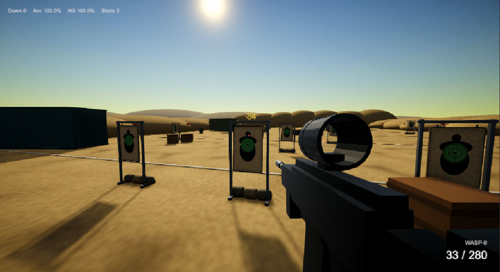
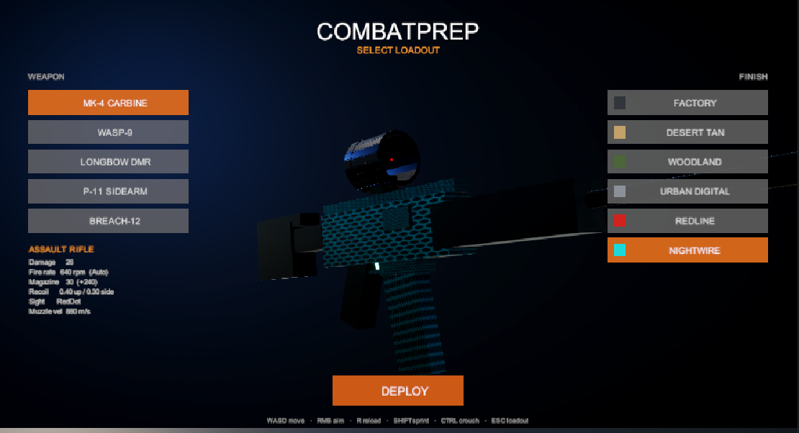
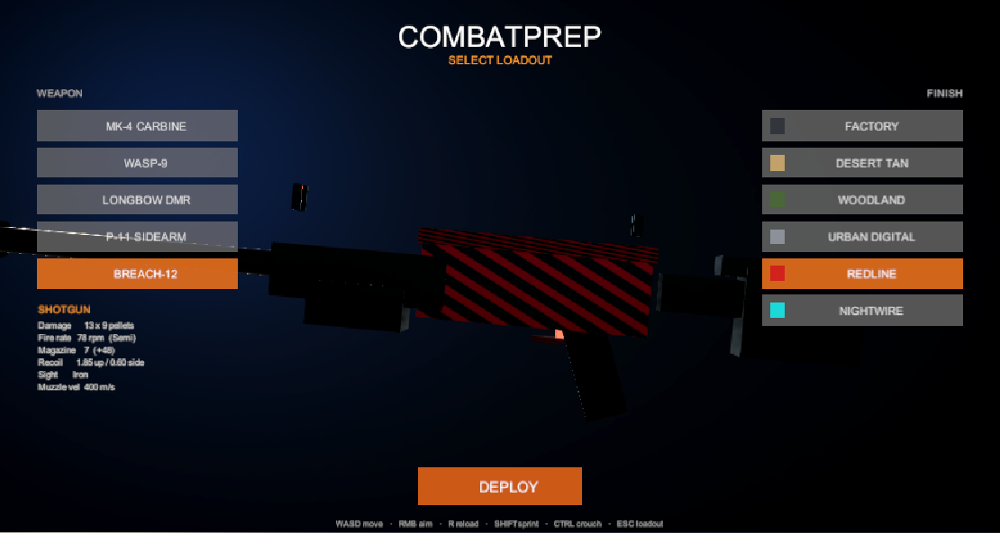
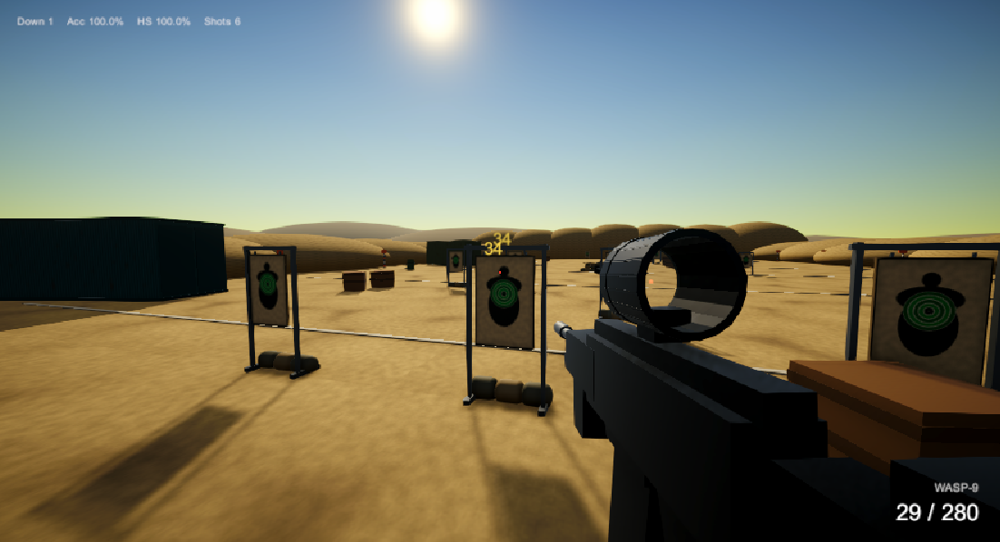
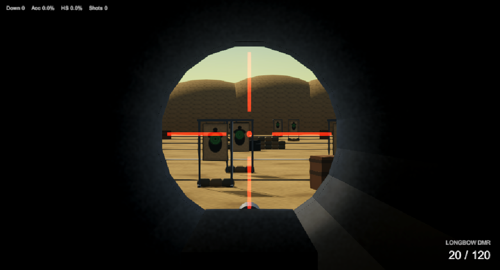

# CombatPrep

A first-person shooting range made in Unity, built under one rule: **nothing is downloaded
or imported.**

No 3D models, no textures, no sound files, no fonts. Every gun, every target, every sand
dune and every gunshot is created by code while the game is running. The Unity scene file
contains a single empty object — everything else is built from scratch when you press Play.

> **How this was made:** I planned the project, decided what to build, played each version
> and worked out what needed fixing. The code itself was written with the help of
> [Claude Code](https://claude.com/claude-code), an AI coding assistant. I've said so here
> because being straightforward about it matters more to me than appearing to have done it
> alone.



## The idea

Normally when you make a game you download models and sounds that other people made. I
wanted to see what happens if you can't do that — if every single thing has to be produced
by writing code instead.

It turns out you can get quite far:

- **Guns** are built from about 25 of Unity's basic shapes — cubes, cylinders and spheres —
  stacked into a rifle.
- **Textures** are drawn pixel by pixel in code: camouflage patterns, rusted metal, sand,
  concrete, and the printed paper target sheets.
- **Sounds** are generated as raw audio. A gunshot is three layers mixed together — a sharp
  crack, a low thump, and the echo afterwards.
- **The range itself** — dunes, shipping containers, sandbags, barrels — is assembled by a
  script when the game starts.

## What's in it

Five weapons — an assault rifle, submachine gun, marksman rifle, pistol and shotgun — each
with six colour schemes you choose before playing. The patterns are generated too, so the
camouflage and stripes are drawn by code rather than painted by hand.





Targets are paper silhouettes hanging in steel frames. They swing backwards when you hit
them and drop flat when you knock them down, then pop back up with a fresh sheet. Some
slide sideways, some bob up and down, and some jump to random positions, so you can
practise different kinds of aiming.



## Some things I wanted to get right

**Recoil you can learn.** Each gun kicks in the same pattern every time instead of
randomly, so with practice you can pull down against it — the way it works in competitive
shooters. Pulling against the recoil properly cancels it out rather than fighting the
game.

**An honest crosshair.** The crosshair opens up by exactly as much as your bullets actually
spread. It isn't a decoration; it's showing you the real number.

**Sights that work.** Each scope is a hollow ring you genuinely look through, with a glowing
reticle sitting on the centre line, rather than a picture pasted over the screen.



## Running it

You'll need **Unity 6000.4.8f1** or newer.

1. Open the project in Unity.
2. In the menu bar, choose **CombatPrep → Build Range Scene**.
3. Press **Play**, pick a weapon, and deploy.

| Key | Does |
|---|---|
| `WASD` / Mouse | Move / look |
| Left click / Right click | Fire / aim |
| `R` | Reload |
| `Shift` / `Ctrl` / `Space` | Sprint / crouch / jump |
| `Esc` | Back to weapon selection |

## How the code is organised

```
Assets/Scripts/
  Core/      Startup, the range builder, and the shape/texture/material helpers
  Player/    Movement, mouse look, input
  Weapons/   The five weapons, recoil, spread, and how guns are assembled
  Skins/     Colour schemes and pattern generation
  Targets/   Targets, how they're built, and how they move
  Audio/     Sound generation
  FX/        Tracers, impacts, bullet holes, camera shake
  UI/        Heads-up display and the weapon selection menu
```

If you'd like the detailed technical reasoning behind the aiming and recoil systems, it's
written up in [COMBATPREP.md](COMBATPREP.md).

## Built with

Unity 6000.4.8f1, C#, Universal Render Pipeline
