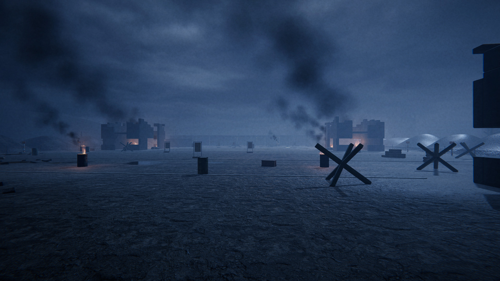
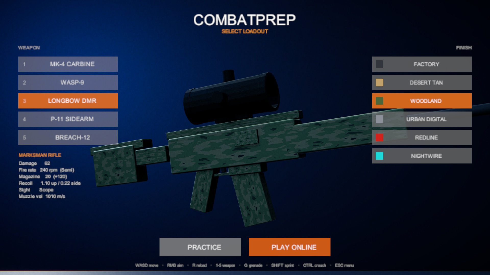
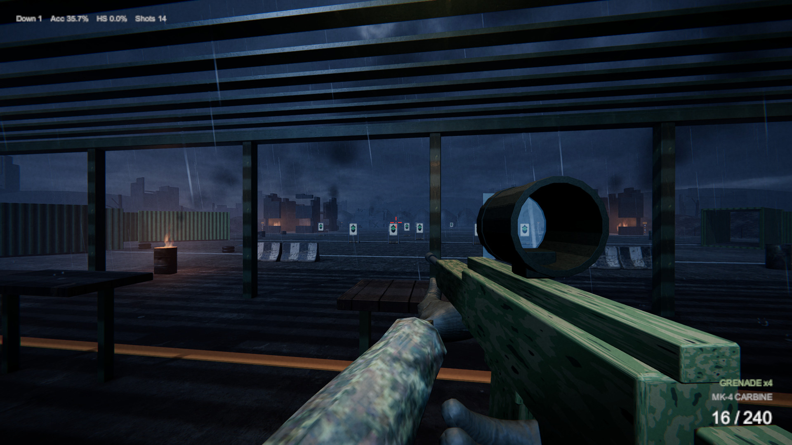
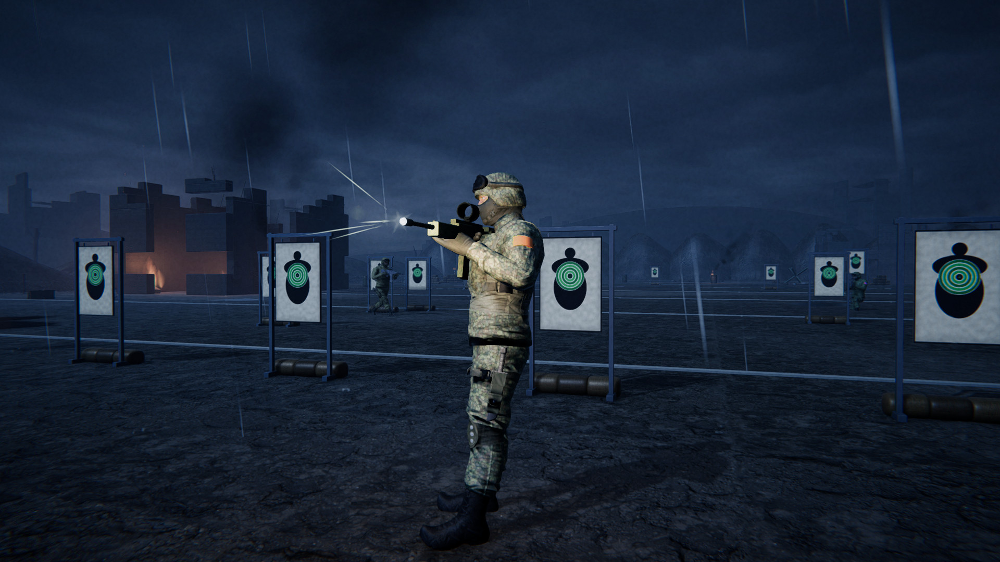
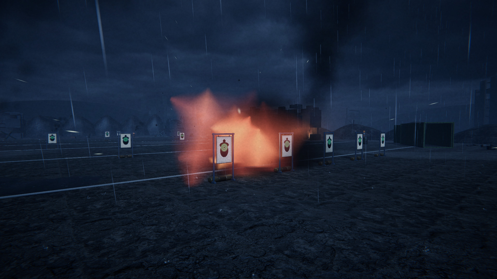
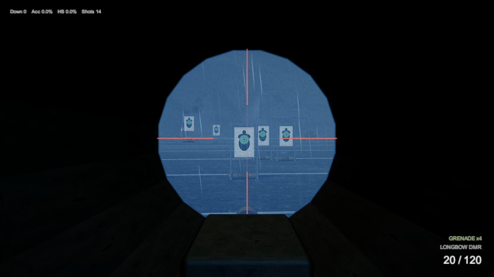
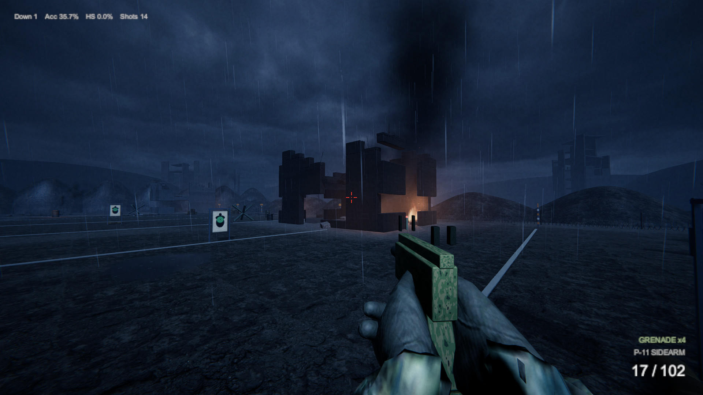
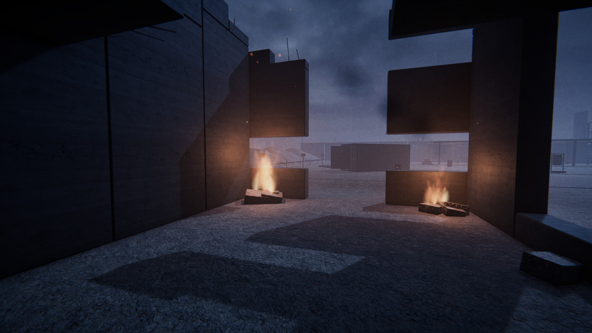

# CombatPrep

A first-person shooter made in Unity: a shooting range for practising your aim, and online
matches for up to four players, set in a rain-soaked war zone at dusk.

The Unity scene holds just two objects — one that builds everything when you press Play (Bootstrap) , and the network manager
for online games.

For the war-zone: the ground, concrete, containers, sandbags, the sky and a few props use free, public-domain
textures and models from [Poly Haven](https://polyhaven.com), the soldiers you fight online are a
rigged model shared under CC BY, animated with Mixamo, and the gunshots are real recordings from
a public-domain firearm library (all listed in [CREDITS.md](CREDITS.md)). The guns, the targets,
the storm, the visual effects and every other sound are made in code.

> **How this was made:** I planned the project, decided what to build, played each version
> and found bugs and errors. The code itself was written with the help of
> [Claude Code](https://claude.com/claude-code), an AI coding assistant.



##   Assets built with code

- **Guns** are built from about 25 of Unity's basic shapes — cubes, cylinders and spheres —
  stacked into a rifle.
- **Textures** are drawn pixel by pixel in code: the camouflage and stripe patterns on the
  weapon finishes, the printed paper target sheets, and the smoke, flames, sparks, bullet holes
  and puddles of the effects.
- **Sounds** are generated as raw audio. A gunshot is three layers mixed together — a sharp
  crack, a low thump, and the echo afterwards. (the crack and thump
  are real recordings; the echo is still synthesised under them.) 
- **The arena** — earth berms, shipping containers, sandbags, craters, wire and four shelled
  buildings — is assembled by a script when the game starts. It always uses the same random
  seed, so every player in an online match gets exactly the same arena without it ever being
  sent over the network.
- **The storm** is code as well: clouds drifting with the wind, rain that stops at roofs and
  splashes where it lands, lightning that throws shadows across the arena, thunder sound that
  arrives a few seconds later, and shelled buildings still burning, their smoke leaning with
  the wind.

## What's in it

Five weapons — an assault rifle, submachine gun, marksman rifle, pistol and shotgun — each
with six finishes you choose before playing. You carry all five and switch between them with
the number keys; the one you pick is the one you start with. The patterns are generated too,
so the camouflage and stripes are drawn by code rather than painted by hand.



**Practice.** Targets are paper silhouettes hanging in steel frames. They swing backwards when
you hit them and drop flat when you knock them down, then pop back up with a fresh sheet. Some
slide sideways, some bob up and down, and some jump to random positions, so you can practise
different kinds of aiming. A hit marker shows each hit — white on the body, red for a headshot,
bigger when it knocks the target down — and the corner of the screen keeps count of targets
dropped, accuracy and headshots.



**Playing online.** Choose PLAY ONLINE and host a match: you get a short code that up to three
friends type in to join, and you start the match once someone has joined. It's every player for
themselves. It runs on Unity's Lobby and Relay services.
When you're eliminated you see who got you, and three seconds later you're back in at the spawn
point furthest from your opponents; a feed in the corner shows who eliminated whom. Other players appear as animated soldiers carrying the
gun and finish they chose, and their bodies lean with where they're aiming.



**Grenades.** Press `G`, hold the left mouse button to see the projectile trajectory, and let go to
throw. You carry four, topped up each time you respawn online. In an online match it hurts anyone with a clear line to the blast —
including whoever threw it.



## Some things I wanted to get right

**Recoil you can learn.** Each gun kicks in the same pattern every time instead of
randomly, so with practice you can pull down against it — the way it works in competitive
shooters. Pulling against the recoil properly cancels it out.

**An honest crosshair.** The crosshair opens up by exactly as much as your bullets actually
spread. It isn't a decoration; it's showing you the real number.

**Sights that work.** Each scope is a hollow ring you genuinely look through, rather than a
picture pasted over the screen. The red dot and the scope's crosshair are drawn on the sight's
glass, pinned to the exact point your bullets go - so they stay on target while the gun kicks -
and stay one pixel thin at any zoom.



**Hands on the gun.** Your arms aren't a canned animation. Every frame they reach for the grip
and fore-end of whatever gun you're holding, so they follow its kick, its sway and the reload.
The pistol (4) is held in both hands.



**Fair hits online.** Whoever fires works out what their bullets hit, so shooting feels
instant even with some lag. The host then checks every reported hit — that the gun could have
fired that fast and reached that far — and works out the damage itself.

**Light in the air.** Light scatters in the rain and haze, so the storm light and the fires
glow through the air. Puddles and wet ground reflect what's really around them — the dark sky, the ruins,
the fires — and the fires throw flickering shadows across the walls.



## Running it

**To play** (Windows, 64-bit):

1. Download `CombatPrep-Windows.zip` from [Releases](https://github.com/parth-thakur38811/CombatPrep1/releases/latest)
2. Extract all files
3. Open the CombatPrep1.exe file. If Windows says it protected your PC, click **More info**,
   then **Run anyway** - the game isn't signed by a registered publisher
4. Practice or Play Online with friends (online play needs an internet connection)

**To open the project in Unity** you'll need **Unity 6000.4.8f1** or newer:

1. Open the project in Unity.
2. In the menu bar, choose **CombatPrep → Build Range Scene**.
3. Press **Play**, pick a weapon and a finish, then choose **PRACTICE**, or **PLAY ONLINE** to
   host or join a match.

| Key | Does |
|---|---|
| `WASD` / Mouse | Move / look |
| Left click / Right click | Fire / aim |
| `R` | Reload |
| `1`–`5` | Switch weapon |
| `G` | Grenade — hold left click to aim the throw, release to throw |
| `Shift` / `Ctrl` / `Space` | Sprint / crouch / jump |
| `Esc` | Back to the menu (online, this leaves the match) |

### Soldier animations (online play)

Other players appear as an animated soldier. The animations come from Mixamo, whose terms don't
allow sharing the files, so they aren't in this repository - without them, online players are
drawn as simple block soldiers instead. To add them:

1. Sign in at [mixamo.com](https://www.mixamo.com) (free Adobe account).
2. Download rifle animations for idle, walking and running (forwards, backwards and to the
   sides), crouching (still and walking), firing and a death. Choose **FBX for Unity** and
   **Without Skin**, and leave **In Place** unticked - the game uses how far each clip travels
   to match its pace to the players' real speed.
3. Put the files in `Assets/Art/Characters/Mixamo/`. Unity sorts them by their names and builds
   the soldier's animation controller by itself.
4. *You will have to create a new build using Unity for importing animations.*

## How the code is organised

```
Assets/Scripts/
  Core/      Startup, lighting, the arena builder, and the shape/texture/material helpers
  Player/    Movement, mouse look, input, and your first-person arms
  Weapons/   The five weapons, recoil, spread, grenades, and how guns are assembled
  Skins/     Weapon finishes and pattern generation
  Targets/   Targets, how they're built, and how they move
  Net/       Online play: sessions, networked players, and other players' soldiers
  Audio/     Sound generation
  FX/        Effects (rain, fire, muzzle flash, tracers, impacts), the storm, light in the air
  UI/        The HUD, the weapon selection menu and the online lobby
Assets/Editor/   Tools that set up the scene and the network manager, and turn the imported art,
                 the soldier and the effect recipes into game assets
Assets/Shaders/  The storm sky, the light in the air and the sight reticle
```

If you'd like the detailed technical reasoning behind the aiming and recoil systems, it's
written up in [COMBATPREP.md](COMBATPREP.md).

## Built with

Unity 6000.4.8f1, Claude Code, C#, Universal Render Pipeline, Netcode for GameObjects, Unity Lobby and Relay

## Licence

© 2026 Parth Thakur. All rights reserved - see [LICENSE](LICENSE). The third-party textures,
model and recordings keep their own licences, listed in [CREDITS.md](CREDITS.md).
